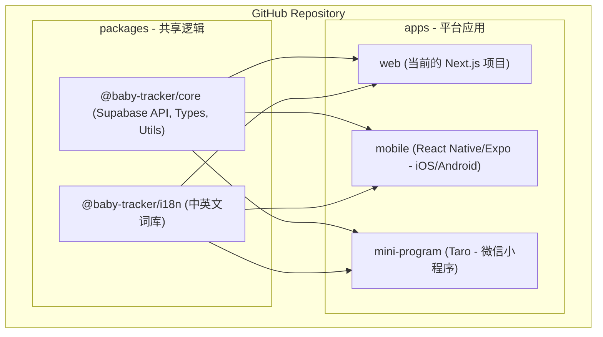

# 📱 多端开发 (iOS/Android/小程序) 代码管理与技术架构方案

鉴于您目前已有 Next.js 项目并运行在 GitHub Pages，且未来计划扩展 iOS、安卓和微信小程序，以下是推荐的技术架构和代码管理方案：

## 1. 核心思路：逻辑共享，视图分离 (Logic Sharing, View Separation)

为了避免在不同平台重复编写业务逻辑（如 Supabase 调用、数据验证、多语言翻译），建议采用 **Monorepo (单仓多包)** 架构。

### 推荐架构图

---

## 2. 代码管理方案

### 方案 A：Monorepo (使用 Turborepo) —— **推荐**
使用 **Turborepo** 或 **Nx** 管理。
*   **优点**：
    *   一套代码库，方便同步更新数据结构或 API。
    *   `packages/core` 统一处理 Supabase 认证和数据库交互。
    *   各端可以根据平台特性进行 UI 深度优化。
*   **挑战**：需要对现有目录结构进行一次重构。

### 方案 B：跨端框架 (使用 Taro) —— **最高效**
**Taro** (京东开源) 是一个以 React 为基础的跨端框架，可以一套代码编译到 **微信小程序、iOS、Android 和 H5**。
*   **优点**：
    *   利用您现有的 React 经验。
    *   **一套代码搞定小程序和 App**。
*   **建议**：如果您希望开发效率最大化，可以将当前 Next.js 的逻辑迁移到 Taro 项目中。

---

## 3. 具体实施路径

### 第一步：拆分业务逻辑 (Refactoring)
将当前项目中 `src/lib/supabase.ts`、`src/components/LanguageProvider.tsx` 中的词条、以及通用的日期处理函数，抽离出来。
*   **目标**：使这些逻辑不依赖于 DOM 或 Next.js 特有 API。

### 第二步：选择移动端技术栈
1.  **App (iOS/安卓)**：推荐使用 **Expo (React Native)**。
    *   它是 React 开发者进入移动开发的最快路径。
    *   支持 Supabase。
    *   UI 体验比网页版流畅得多。
2.  **小程序**：推荐使用 **Taro**。
    *   如果必须独立于 App 运行且追求原生小程序体验，Taro 是 React 开发者的首选。

### 第三步：持续集成与部署 (CI/CD)
*   **Web**：保持现有的 GitHub Actions 部署到 GitHub Pages。
*   **App**：使用 **EAS (Expo Application Services)** 进行云端打包。
*   **小程序**：使用微信开发者工具或 Taro 提供的 CI 工具自动化上传代码。

---

## 4. 给您的决策建议

| 需求优先级 | 推荐方案 | 说明 |
| :--- | :--- | :--- |
| **效率至上** (个人开发，快速上线) | **Taro** | React 语法，一套代码覆盖小程序 + App。 |
| **体验至上** (追求 App 的极致流畅) | **Next.js (Web) + Expo (App)** | 保持 Web 现状，App 用 React Native 重新构建 UI，共享逻辑。 |
| **成本最低** (不重写) | **Capacitor** | 将现有的 Next.js 打包成 iOS/安卓套壳 App。但**无法解决微信小程序**。 |

> [!TIP]
> **我的最终建议**：采用 **Monorepo** 架构，将 Supabase 和业务逻辑库独立。
> *   保持当前的 **Next.js** 作为展示站和 Web 版（GitHub Pages）。
> *   新开一个 **Expo** 项目用于 iOS/Android。
> *   新开一个 **Taro** 项目专门用于微信小程序。
